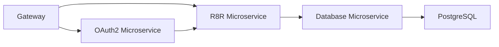

# Rater (r8r)

Work in progress...

# API
`POST /user/login`
`POST /user/register`
`GET /user/logout`

`GET /token/refresh`

`GET /posts [get posts, query params]`
`POST /post [create a new post]`
`PUT /post/:id [update post]`
`GET /post/:id [get post]`
`DELETE /post/:id [delete post]`

`POST /post/:id/rate [rates a post]`

`POST /post/:postId/image [upload an image to the post]`
`GET /post/:postId/images [get post images]`
`GET /post/:postId/images/:imageId [get post image]`
`DELETE /post/:postId/images/:imageId [delete post image]`

